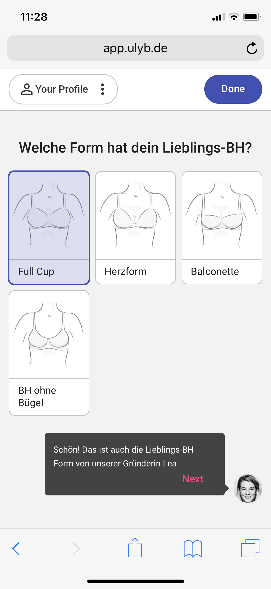
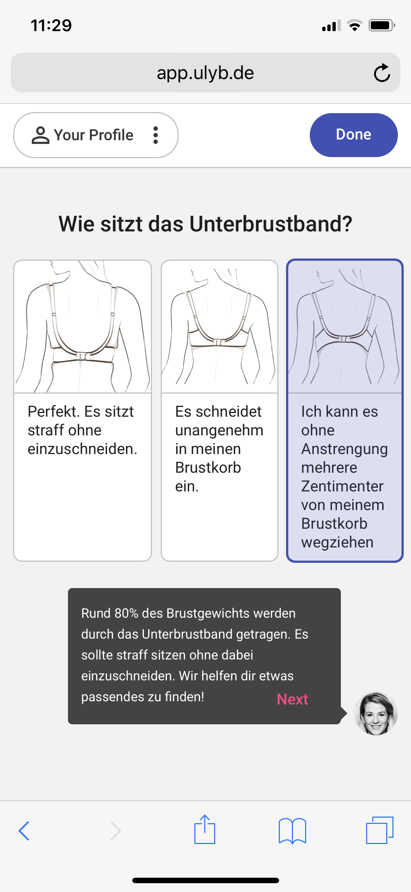
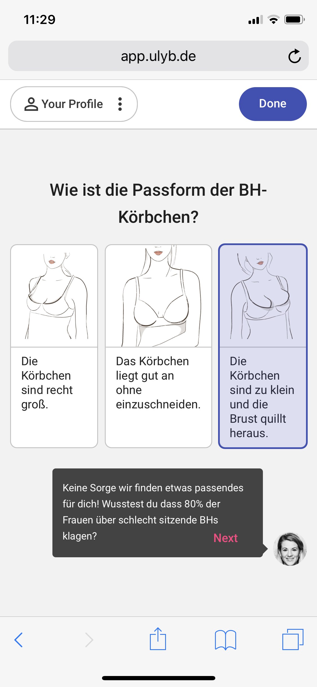
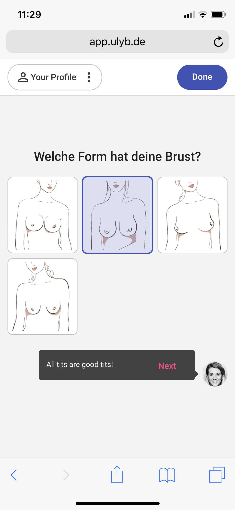
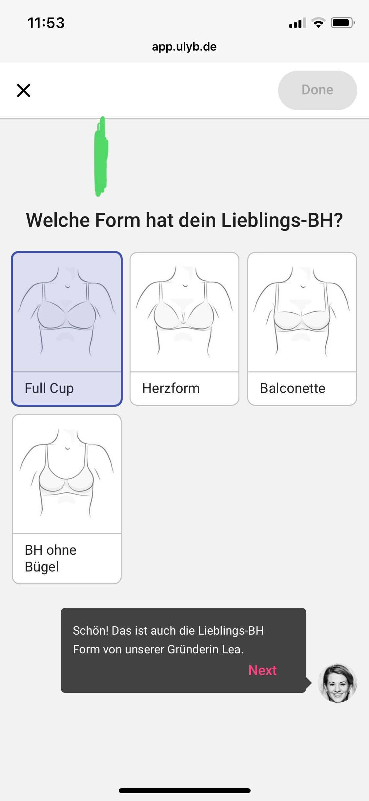
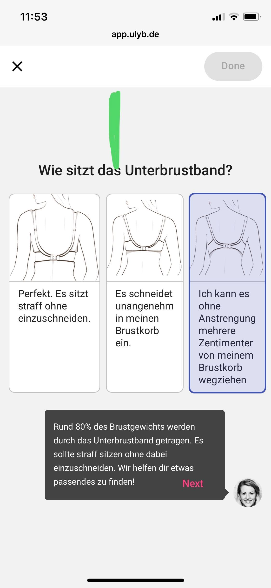
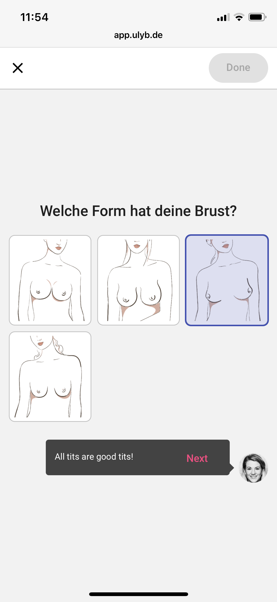

# B2B - User Interface

## EXAMPLES TAKEN FROM FORMER MVP

These examples from the first B2C version aka MVP (as a template for current B2B versions), show very well that we will become a little easier in the design of the B2B segment, than in the B2C segment with brajuu.com. We will only make a few optical things configurable, like colors, pictures of the questions, the background or even smaller other things. We concentrate first of all on the functionality. Especially regarding the configurable or exchangeable questions for the respective customer, the entire process flow and the presentation of the results. Multilingualism and the change of language, if available, is also a secondary objective.

